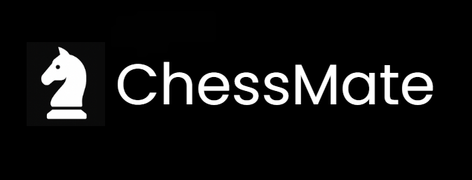

# ChessMate: An Online Chess Platform

**ChessMate** is a modern, interactive online chess platform designed to bring chess enthusiasts together for real-time matches. Play against friends or find opponents from around the world in a clean and intuitive environment.

## Table of Contents

- [About ChessMate](#about-chessmate)
- [Features](#features)
- [Demo](#demo)
- [Live Demo](#live-demo)
- [Tech Stack](#tech-stack)
- [Contact](#contact)

## About ChessMate

ChessMate provides a seamless and engaging online chess experience. Whether you're looking to play a quick game, challenge a friend, or improve your skills, ChessMate offers a user-friendly platform with real-time gameplay. Our focus is on delivering a smooth and enjoyable chess experience for players of all levels.

## Features

* **Real-time Multiplayer Matches:** Play live chess games against other users.
* **User Account Management:** Create and manage your profile.
* **Intuitive User Interface:** Clean and easy-to-navigate board and controls.
* **Responsive Design:** Enjoy playing on desktop, tablet, or mobile devices.
* **In-Game Chat:** Communicate with your opponent during a match.

## Demo

See ChessMate in action!

https://github.com/user-attachments/assets/4a00e52d-b976-4cb8-928b-9012096356c5

## Live Demo

Check out a live version of this project here: [Visit ChessMate](http://chessmate.infinityfreeapp.com/)

## Tech Stack

* **Frontend:** HTML, CSS, JS, React JS, Bootstrap
* **Backend:** PHP
* **Database:** MySQL
* **Hosting:** Infinityfree Hosting

## Contact

If you have any questions or need support, please reach out to us using the following methods:

*   **Email:** [sarveshwashindkar@gmail.com](mailto:sarveshwashindkar@gmail.com)
*   **GitHub Issues:** You can report bugs or request features on our [GitHub Issues page](https://github.com/Sarvesh-Washindkar/ChessMate/issues)

We strive to respond to all inquiries within a reasonable timeframe. Thank you for your interest in our project!

